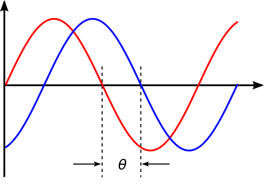
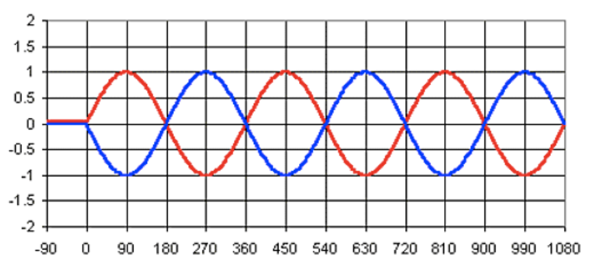
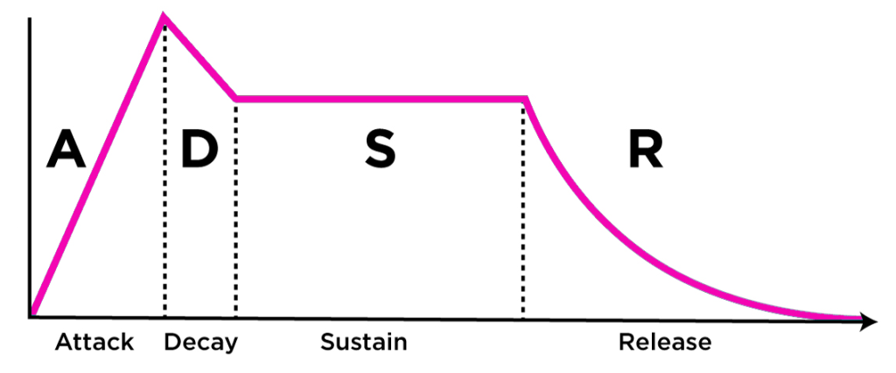

**Acoustic** is the interdisciplinary science that deals with the study of mechanical waves in gases, liquids and solids
including vibration, sound, ultrasound and infra-sound.

### Phase

The **phase** specifies the location or timing of a point within a wave cycle of a repetitive waveform.

**Phase shift**

**Phase reversal**

!!! Warning 
    Two sounds in phase reversal cancel each other out.

!!! Info 
    Two identical sounds were sum increasing the volume of the double

### Sound

**Sound** is a vibration (compression and rarefaction) that propagates as an acoustic wave, through a transmission
medium such as a gas, liquid or solid.

Sound waves are often simplified to a description in terms of sinusoidal plane waves, which are characterized by these
generic properties:

- Frequency (in Hz), or its inverse, wavelength
    - Low: 20Hz-200Hz
    - Middle-Low: 200Hz-1000Hz
    - Middle-High: 1000Hz-5000Hz
    - High: 5000Hz-20000Hz
- Amplitude, sound pressure or Intensity (dB)
- Speed of sound: the speed of sound in a particular substance was equal to the square root of the pressure acting on it
  multiplied the heat capacity ratio divided by its density. Dependent from the ambient, independent of the propagation.
  (~ 344 m/s)
- Direction: omnidirectional

**Reflection**

An acoustic travelling wave can be reflected by a solid surface. If a travelling wave is reflected, the reflected wave
can interfere with the incident wave causing a standing wave in the near field. The sound when impact a surface:

- one part was **absorbed**
- one part was **transmitted**
- one part was **reflected** (both in phase and out of phase, falsifying or deleting some frequencies of the sound)

!!! Warning 
    If the surface where the sound reflect opposes greater resistance than the means that leads it. The sound
    will be reflected in phase, otherwise in out of phase.

Principal characteristics of sound are:

1. **Pitch**: perceived as how "low" or "high" a sound is and represents the cyclic, repetitive nature of the vibrations
   that make up sound. For simple sounds, pitch relates to the frequency of the slowest vibration in the sound (called
   the fundamental harmonic) (Hz).

2. **Loudness**: perceived as how "loud" or "soft" a sound is and relates to the totalled number of auditory nerve
   stimulations over short cyclic time periods, most likely over the duration of theta wave cycles (dB).

3. **Duration**: perceived as how "long" or "short" a sound is and relates to onset and offset signals created by nerve
   responses to sounds. The duration of a sound usually lasts from the time the sound is first noticed until the sound
   is identified as having changed or ceased.

4. **Timbre**: perceived as the quality of different sounds (e.g. the thud of a fallen rock, the whir of a drill, the
   tone of a musical instrument or the quality of a voice) and represents the pre-conscious allocation of a sonic
   identity to a sound.

   

!!! Info 
    Transient defined means a precise variation of the amplitude.

**Harmonic**

A **Harmonic** is a wave with a frequency that is a positive integer multiple of the fundamental frequency, the
frequency of the original periodic signal, such as a sinusoidal wave.

The original signal is also called the 1st harmonic(main harmonic), the other harmonics are known as higher harmonics
(collateral harmonic, one or more depending on the instrument). As all harmonics are periodic at the fundamental
frequency, the sum of harmonics is also periodic at that frequency. The set of harmonics forms a harmonic series. Not
all the harmonics are in the tonality of the song (E.g VII m), this will cause some resonances.

!!! Info 
    Two notes with fundamental frequencies in a ratio equal to any integer power of two (e.g., half, twice, or four
    times) are perceived as very similar. Because of that, all notes with these kinds of relations can be grouped under the
    same pitch class.
