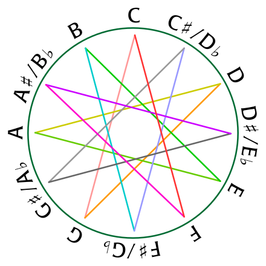
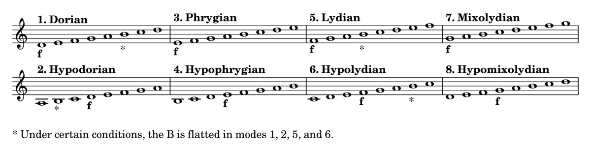

**Harmony** is the process by which the composition of individual sounds, or superpositions of sounds, is analysed by
hearing. Usually, this means simultaneously occurring frequencies, pitches (tones, notes), or chords.

Its perception is based on consonance, pitch relationships are described as sounding more pleasant, euphonious, and
beautiful than dissonant relationships which sound unpleasant, discordant, or rough.

The study of harmony involves chords and their construction and chord progressions and the principles of connection that
govern them. It refers to the "vertical" aspect of music, as distinguished from melodic line or the "horizontal" aspect.

Counterpoint, which refers to the relationship between melodic lines, and polyphony, which refers to the simultaneous
sounding of separate independent voices, are therefore sometimes distinguished from harmony. A dissonant chord (chord
with tension) "resolves" to a consonant chord. Harmonization usually sounds pleasant to the ear when there is a balance
between consonance and dissonance. Simply put, this occurs when there is a balance between
"tense" and "relaxed" moments.

### Background

The background is the melodic/harmonic part below the sound. Its role is to sustain the melodic part:

Rules:

- use only chord notes:
    - where the melody moves the background doesn't move
    - where the melody doesn't move the background moves
- as the harmonic continuity establish a link with chords, as well as jump when the chord remains stationary.
- where the melody and the background sound simultaneously it better keep a distance of III but not more than an VIII.
- where the melody and the background doesn't sound simultaneously them could collide freely.

### Bass writing

The Bass (Double bass) is a transposed instrument, take place on F-Clef (it is written in an octave up rather its
original sound to avoid ledger lines). The four notes of the bass are: E, A, D and G.

Rules:

Often alternate between the I (clarify and reiterate the melody) and the V.

The bass could move as follows:

1. With one chord for bar.

2. When a I is followed from a V, notes of the chord.

3. With 2 chords for bar.

4. Rest could be replaced from repeated notes.

5. Use I - V could be used instead of I - I

6. Scale notes (usually III - VII) could be used instead of I and V to create a melodic sequence.

7. When a 7 chord, or a m7 chord or a minor chord. If the fundamental goes to the V perfect, and it is followed from an
   IV up to the fundamental, a V diminished could be used as passing note in order to create a chromatic sequence
   I-V-bV-(I of IV).

!!! Info Bass sounds well when it is linked with the kick or in backlash.

!!! Warning The III and the VII doesn't sound very well on the beat instead of passing note on the upbeat (duration less
or equal of an 1/8).

It is useful to harmonise the singing note with the bass with a III or a VI.

### Chord

**Chord**, in music, is any harmonic set of pitches/frequencies consisting of multiple notes (also called "pitches")
that are heard as if sounding simultaneously. For many practical and theoretical purposes, arpeggios and broken chords
(in which the notes of the chord are sounded one after the other, rather than simultaneously), or sequences of chord
tones, may also be considered as chords in the right musical context.

The most frequently encountered chords are triads, so called because they consist of three distinct notes: the root
note, and intervals of a third and a fifth above the root note.

The symbols used for notating chords are:

- **m**, **min**, or **−** indicates a minor chord **(I - III Minor - V Perfect)**.
- **M**, **Ma**, **Maj**, **Δ**, or (**no symbol**) indicates a major chord. In a jazz context, this typically indicates
  that the player should use any suitable chord of a major quality, for example a major seventh chord or a 6/9 chord
  **(I - III Major - V Perfect)**.
- **+** or **aug** indicates an augmented chord **(I - III Augmented - V Perfect)**.
- **o** or **dim** indicates a diminished chord, either a diminished triad or a diminished seventh chord
  **(I - III Minor - V Diminished)**.
- **ø** indicates a half-diminished seventh chord. In some fake books, the abbreviation m7(♭5) is used as an equivalent
  symbol **(I - III Minor - V Diminished - VII Minor)**.
- **2** is mostly used as an extra note in a chord (add2, sus2) **(I - II Major - V Perfect)**.
- **3** is the minor or major quality of the chord and is rarely written as a number.
- **4** is mostly used as an extra note in a chord (add4, sus4) **(I - IV Perfect - V Perfect)**.
- **5** is the (perfect) fifth of the chord and is only written as a number when altered (e.g., F7(♭5)). In guitar
  music, like rock, a "5" indicates a power chord, which consists of only the root and fifth, possibly with the root
  doubled an octave higher.
- **6** indicates a sixth chord. There are no rules if the 6 replaces the 5th or not.
- **7** indicates a dominant seventh chord, on each degree of the scales the 7th exists **(I - III - V - VII)**:
    - **Ma7/Δ**: Major chord + VII Major (III Major up)
    - **7/dom**: Major chord + VII Minor (III Minor up)
    - **m7/-**: Minor chord + VII Minor (III Minor up)
    - **m7(♭5)/ø**: Diminished chord + VII Minor (III Minor up)

!!! Note
**Resolution of the dominant VII chord**

    - complete: Bass VII - and Violin (any of the3 positions)
    - incomplete: Bass VII - and Violin (omit the V in the 3 positions)

    VII incomplete - I tonic:
    
    1. The VII of the chord tends to the III of the I tonic chord
    2. The III of the chord tend to the I of the I tonic chord
    3. The VIII (double substituted of the V) in common with the V Perfect of the I tonic

    In Major tonality IV joint down to III, VII joint up to I/VIII

- **9** indicates a ninth chord, which in jazz usually includes the dominant seventh as well, if it is a dominant chord
  (**2** + an octave).
- **11** indicates an eleventh chord, which in jazz usually includes the dominant seventh and ninth as well, if it is a
  dominant chord(**4** + an octave).
- **13** indicates a thirteenth chord, which in jazz usually includes the dominant seventh, ninth and eleventh as well
  (**6** + an octave).
- **6/9** indicates a triad with the addition of the sixth and ninth.
- **sus2** (or simply 2) indicates a sus chord with the third omitted and the second (which may also be called the
  ninth) used instead. As with "sus4", a "sus2" chord can have other scale degrees added (Asus2(add♭7) or Asus2(add4)).
- **sus4** (or simply 4) indicates a sus chord with the third omitted and the fourth used instead. Other notes may be
  added to a sus4 chord, indicated with the word "add" and the scale degree (Asus4(add9) or Asus4(add7)).

!!! Note Sus chords (because of there is no the third) creates instability, to give colour to a melody and to link
chords with shared note.

- **(♭9)** (parenthesis) is used to indicate explicit chord alterations (e.g., A7(♭9)). The parenthesis is probably left
  from older days when jazz musicians weren't used to "altered chords".
- **alt** or **alt dom** indicates an altered dominant seventh chord (e.g., G7♯11).
- **omit5** (or simply **no5**) indicates that the (indicated) note should be omitted.

**Principal cadences**

- **Perfect cadence**: V - I
- **Suspended cadence**: I - V
- **Plagal (church-ist) cadence**: IV - I
- **Half Plagal cadence**: I - IV

**Polyphony movements**

- **Direct**: parts move on the same direction
- **Oblique**: one part fix and the other go up or down
- **Opposite**: one part goes up and the other down.
- **Mixed**: union of the previous three.

**Chords position**

1. **I position** (the octave sings): Bass - I and Violin III (Tenor) V (Alto) I (Soprano)
2. **II position** (the third sings): Bass - I and Violin V I III
3. **III position** (the fifth sings): Bass - I and Violin - I III V

To choose between one position from the other take the name of **voicing**.

**Inversion**

An inversion is a type of change to intervals, chords, voices (in counterpoint), and melodies. In each of these cases,
"inversion" has a distinct but related meaning.

- Root position: Bass - I and Violin (whatever disposition).
- I inversion: Bass - III and Violin (creates an III - VI - VIII, it is call 6th chord, it could be helpful avoid the
  inversion with vocal-third 'cause of weigh down the composition).
- II inversion: Bass - V and Violin (creates an IV - VI - VIII, it is call 4th and 6th chord (4/6), suggests pre o post
  of the perfect chord).

!!! Note

    In the past to create a 7th it could be prepareted before, insert it on the previous chord.

    **Inversion of 7th chord**

    The same of the classic inversion adding the III inversion.

    - III inversion: Bass - VII and Violin (creates an II - IV - VI)

**Additional notes to chord**

Add some notes to the fundamental didn't change the nature of the chord, thoose notes can be use melodically or
harmonically:

- Major: 6M, 7M, 9M
- Minor: 6M, 7M, 9M, 11P
- Minor VII: 7M, 11P
- VII: 5P/5aug/5dim, 9m/9M, 11P/11aug,13M

The IX, generally is not added without VI or th VII, the 11th without the VI or the VII and the IX.

**Modulation chords**

A modular chord could be the V down or an IV up, this is it called resolution trend. Whatever is the tonality we can use
the V7 rather a chord of a scale played before of it.

Each chord on I degree could be preceded by a chord of VII7 an IV Perfect down or a V Perfect up. Then each V7 could be
preceded from its V7 (V7/V relative).

Each V7 also could be preceded by a IIm7 is a II half diminished an IV Perfect down or a V Perfect up (this allows to
create II - V - I).

Each IIm could be preceded from a V7 (V7/II relative).

!!! Info The same rules worth for major and minor chord.

!!! Warning Also a IV Major could be replaced with a IV Minor as long as the altered note was not played on the previous
chords.

### Circle of fifth

### Harmonization

**Harmonization** is a simultaneous succession in order to create a sequence of chords: *closed* or *open harmony*.

**Harmonic Continuity**

In this method chords could be appeared in each kind of inversion, inserting the VI Major to create a 4 degrees chord.

*Base principle of harmonic continuity*: keep the note in common between chords (the same vocals' registry).

!!! Warning

    If two chords have no notes in common it's important to keep the top note (singing note) near to a note of the next 
    chord, at least if you don't want to change register.

The **Soprano Top Note** (guide note) will be supported from the notes of the chord *from the top to the bottom* (more
closely possible); 13th, 11th, 9th and the 7th can be used **only on the sing part or under much higher extensions**
(A 9th under an 11th). This needs to avoid the number of the notes which can be added to particulars chords.

!!! Info

    When a chord remains stationary the guide note could be changed.

!!! Note In harmonization it is better to use at least a 3rd minor under. Often if a 13th, 11th, 9th and the 7th is on
the sing part it used to put an inversion with the root note not at the bottom of the chord.

*Harmonization in 4 parts*

In standard harmony not all the notes of the melody are simple notes of the chord, so it is necessary distinguish:

- chord notes (C)
- chord off-notes (NC)

To harmonize in 4 part could be usefully the I (double), V (double) or the VI.

*Rules to harmonize*

1. Start to harmonize the notes of the chord first from the chord of the melody keeping the disposition as close as
   possible.
2. Harmonizing the note always with the notes of the chords. **The NC replaced the note of the chords suddenly below**.
3. Whatever note of the chord could be use in whatever position, frequency and rhythm in the same chord (Chord/Arpeggio)
4. From the sing part is better to keep a distance of a II Major.
5. Jump of 4th and 5th, but also 6th and 8th are interesting on the attack of the sing part

!!! Note

    - **Chromatic transition**: It is possible use melodically, whatever notes which far cromatically to a structerd 
    note of the chord. Those note will be always of short duration (1/8 or less).

    - **Close note of the scale**: Whatever notes on top of one structured note of the chord. Those note will be always 
    of short duration (1/8 or less).

!!! Info The most important things to understand ia the technique to know the rapport between scale and chord. Use
whatever note which belongs to the key reference to approach to a structured note. **Pay attention to the use the 11th
on the Major chord, it could be a violation**.

### Intervals

An **interval** is the relationship between two separate musical pitches.

Two different kind:

- harmonic: notes are played simultaneously.
- melodic: notes are played in sequence.

The intervals in the major scale are:

| Degree | Kind    | Degree | Kind    |
|--------|---------|--------|---------|
| I      | Perfect | V      | Perfect |
| II     | Major   | VI     | Major   |
| III    | Major   | VII    | Major   |
| IV     | Perfect |        |         |

Kind of intervals:

- Major --> # Augmented --> ## Doubly Augmented
- Major --> b Minor

- Minor --> # Major
- Minor --> b Diminished --> bb Doubly Diminished

- Perfect --> # Augmented --> ## Doubly Augmented
- Perfect --> b Diminished --> bb Doubly Diminished

!!! Note To identify intervals from the sixth onwards it is useful invert the interval, keep in mind these rules:

    - Perfect <-> Perfect
    - Major <-> Minor
    - Augmented <-> Diminished

Rules:

| Interval     | Distance              |
|--------------|-----------------------|
| II Minor     | H                     |
| II Major     | W                     | 
| III Minor    | W+H                   |
| III Major    | 2W                    |
| IV Perfect   | III Major (2W) + H    |
| V Perfect    | III Major + III Minor |
| V Diminished | 2 III Minor           |
| V Augmented  | 2 III Major           |
| VI Minor     | III Major inverted    |
| VI Major     | III Minor Inverted    |
| VII Minor    | II Major Inverted     |
| VII Majoe    | II Minor Inverted     |

### Melody

A **melody**, melodic phrase or melodic line, in musical theory, is a succession of sounds whose structure generates a
musical organism of complete meaning.

**Melody on a succession of note**

1. Chord notes: the chord note could be used on the composition of the melody
2. Chromatic approach: the notes of chromatic approach could precede every note of the chord (near).
3. Scale approach: the notes are present on the tonality referred to the chord and can be used directly on a structured
   note of the chord (near).
4. Hi-Low: tension, supports or delay always a tone (W) up (Hi) rather than a structured note of the chord (Low). In
   chords diminished and half diminished the highest voice are called *Hi* and the lowest *Low*. On the other chords the
   Hi-Low moves with the 13-5, 11-3, 9-1, 5-1 and 7-6. The Hig-Low have no limits of duration, not very pretty at the
   vocal part.

### Modulation

**Modulation** is the change from one tonality (tonic or tonal center) to another. This may or may not be accompanied by
a change in key signature. It means use notes and harmonies deriving from another scale. Two different kind:

- Tonicization (transitory): less than 4 chords, it will be report below the relative chord.

  

- Base modulation (defined): 4 chords to confirm the tonality, and it will be reported on the staff.

  

Types of modulation:

1. **Common-chord** (also known as diatonic-pivot-chord modulation): moves from the original key to the destination key
   (usually a closely related key) by way of a chord both keys share.

2. **Enharmonic**: takes place when one treats a chord as if it were spelled enharmonic as a functional chord in the
   destination key, and then proceeds in the destination key. There are two main types of enharmonic modulations:
   dominant seventh/augmented sixth, and (fully) diminished seventh.

3. **Common-tone**: uses a sustained or repeated pitch from the old key as a bridge between it and the new key (common
   tone). Usually, this pitch will be held alone before the music continues in the new key.

4. **Chromatic**: chromatic progression, one which involves the chromatic inflection of one or more notes whose letter
   name, thus, remains the same though altered through an accidental (often between keys which are not closely related.
   A secondary dominant or other chromatically altered chord may be used to lead one voice chromatically up or down on
   the way to the new key).

5. **Phrase** (also called direct, static, or abrupt): is a modulation in which one phrase ends with a cadence in the
   original key, and the next phrase begins in the destination key without any transition material linking the two keys.
   This type of modulation is frequently done to a closely related key—particularly the dominant or the relative
   major/minor key.

6. **Sequential**: A passage in a given key ending in a cadence might be followed by the same passage transposed (up or
   down) to another key. Although a sequence does not have to modulate, it is also possible to modulate by way of a
   sequence (diatonic or chromatic).

7. **Chain**: Distant keys may be reached sequentially through closely related keys by chain modulation.

8. **Kind-of-chord**: even if there is no note in common, a major chord can be connected to a major chord, a minor to a
   minor and soon.

!!! Info

    *Changes between parallel keys*

    Since **modulation** is defined as a change of tonic (tonality or tonal center), the change between minor and its 
    parallel major or the reverse is technically not a modulation but a **change in mode**. Major tonic harmony that 
    concludes music in minor contains what is known as a Picardy third. Any harmony associated with the minor mode in 
    the context of major musical passages is often referred to as a borrowed chord, which creates mode mixture.

    The most common modulations are to closely related keys (I, V, IV, VI, III, II). V (dominant) is the most frequent 
    goal and, in minor, III (relative key) is also a common goal. Modulation to the dominant or the subdominant is 
    relatively simple as they are adjacent steps on the circle of fifths. Modulations to the relative major or minor are
    also simple, as these keys share all pitches in common. Modulation to distantly related keys is often done smoothly 
    through using chords in successive related keys, such as through the circle of fifths, the entirety of which may be 
    used in either direction:
      

      
      

### Pattern

A **pattern** (or motive) is a cell or germ serving as the basis for repetitive pattern. It is a figure that can be used
with any scale. It is used primarily for solos because, when practiced enough, it can be extremely useful when
improvising. "Sequence" refers to the repetition of a part at a higher or lower pitch, and melodic sequence is
differentiated from harmonic sequence. Identical movement of the bass and defined by the upper triads, inside the
patterns are allowed melodic movements and doublet which is not allowed outside them.

{ style="display: block; margin: 0 auto" }

To determine a pattern occurs at least 4 chords.

In a pattern can be identified:

- parallel octaves
- hidden octaves

### Scale

A **scale** is any set of musical notes ordered by fundamental frequency or pitch. A scale ordered by increasing pitch
is an ascending scale, and a scale ordered by decreasing pitch is a descending scale.

- **Chromatic scale**: each scale step represents a semitone interval
- **Diatonic scale**:
    - **Major scale**: defined by the interval pattern W–W–H–W–W–W–H
    - **Minor scale**: defined by the interval pattern W–H–W–W–H-W-W (the sensible/leading tone is not present)
    - **Harmonic minor scale**: defined as the minor scale except that the seventh degree is raised by one semitone,
      creating an augmented second between the sixth and seventh degrees (to fix the missing of the sensible).

  { style="display: block; margin: 0 auto" }

- **Melodic minor scale**: defined as the minor scale except that the sixth degree is raised by one semitone in the
  ascending form of the scale (jazz minor), while the seventh appears in the descending form of the scale (minor).

  { style="display: block; margin: 0 auto" }

- **Pentatonic scale**: defined as the major scale without the IV (descending sensible/leading tone) and VII grades
  (ascending sensible/leading tone).

!!! Warning A scale is formed at least by 5 notes, otherwise it is a fragment of a scale.

The **modus** relates to the organisation of pitch in scales, start from a specific grade of the major scale.

|     | Modes     | Notes              |
|-----|-----------|--------------------|
| I   | Ionic     | 1 2 3 4 5 6 7      |
| II  | Doric     | 1 2 b3 4 5 6 b7    |
| III | Frigio    | 1 b2 b3 4 5 b6 b7  |
| IV  | Lidio     | 1 2 3 b4 5 6 7     |
| V   | Misolidio | 1 2 3 4 5 6 b7     |
| VI  | Eolio     | 1 2 b3 4 5 b6 b7   |
| VI  | Locrio    | 1 b2 b3 4 b5 b6 b7 |

**Scale degree**

The scale degree is the position of a particular note on a scale relative to the tonic.

{ style="display: block; margin: 0 auto" }

| Degree | Name                                     |
|--------|------------------------------------------|
| I      | Tonica  (Strong or tonal degree)         |
| II     | Sopratonic                               | 
| III    | Mediante                                 |
| IV     | Sottodominante  (Strong or tonal degree) | 
| V      | Dominante (Strong or tonal degree)       | 
| VI     | Sopradominante                           |
| VII    | Sottotonica     (1W from the tonic)      |                                 
| VII    | Sensibile    (1H from the tonic)         |   

Three different group for classification of degrees:

1. Tonic group: I, III, VI
2. Subtonic group: II, IV
3. Dominant group: V, VII

Those chords may be substituted from each others. To keep up a song three are the fundamental degrees: I - IV - V, the
others are collateral.

**Harmony of the scales**

| Major | Minor | Harmonic Minor | Melody Minor | Major 7th |  Harmonic Minor 7th | Melodic Minor 7th |
|-------|-------|----------------|--------------|-----------|---------------------|-------------------|
|   M   |   m   |       m        |      m       |    M7     |       m(M7)         |      m(M7)        |
|   m   |  dim  |      dim       |      m       |    m7     |         ø           |       m7          |
|   m   |   M   |      aug       |     aug      |    m7     |       M7(#5)        |      M7(#5)       |
|   M   |   m   |       m        |      M       |    M7     |         m7          |       7           |
|   M   |   m   |       M        |      M       |    7      |         7           |       7           |
|   m   |   M   |       M        |     dim      |    m7     |         M7          |       ø           |
|  dim  |   M   |      dim       |     dim      |    ø      |        7dim         |       ø           |

!!! Note The V degree as always take part of the tonal group but with the difference that the VII is minor, and it
generates a dominant 7th chord which produce a particular sound, and it tends to the tonic note (it is a leading tone).

!!! Warning It could be useful use a chord in common between two different scales as "bridge" to change tonality, the V
of the Melodic Minor 7th is in common with a V of a Major scale VII or an IV of another Melodic Minor VII
