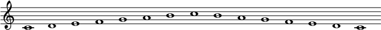
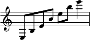

**Music notation** or **musical notation** is any system used to visually represent aurally perceived music played with
instruments or sung by the human voice through the use of written, printed, or otherwise-produced symbols, including
notation for durations of absence of sound such as rests. It is a universal languages.

### Clef

A **clef** (from French: clef 'key') is a musical symbol used to indicate which notes are represented by the lines and
spaces on a musical stave. Placing a clef on a stave assigns a particular pitch to one of the five lines, which defines
the pitches on the remaining lines and spaces.

The three clef symbols used in modern music notation are the G-clef, F-clef, and C-clef. Placing these clefs on a line
fixes a reference note to that line.

{ style="display: block; margin: 0 auto" }

Theoretically, any clef may be placed on any line. With five lines on the stave and three clefs, there are 15
possibilities for clef placement. Six of these are redundant because they result in an identical assignment of the notes
to the lines (and spaces). Thus, there are nine possible distinct clefs, all of which have been used historically.

In modern music, only four clefs are used regularly: treble clef, bass clef, alto clef, and tenor clef. Of these, the
treble and bass clefs are by far the most common. The tenor clef is used for the upper register of several instruments
that usually use bass clef (including cello, bassoon, and trombone), while the alto is mostly only used by the viola.

*Middle C represented on treble, alto, tenor and bass clefs.*

The use of different clefs makes it possible to write music for all instruments and voices, regardless of differences in
range. Using different clefs for different instruments and voices allows each part to be written comfortably on a stave
with a minimum of ledger lines. To this end, the G-clef is used for high parts, the C-clef for middle parts, and the
F-clef for low parts.

A symmetry exists with middle C for the F, C and G clefs. Two mnemonics for learning the clef lines are:

**G**ood **B**oys **D**o **F**ine **A**lways,**E**very **G**ood **B**oy **D**oes **F**ine{ style="display: block;
margin: 0 auto" }

{ style="display: block; margin: 0 auto" }

| Clef   | Note          | Note Location                                |
|--------|---------------|----------------------------------------------|
| G-clef | G4 | on the line that passes through the curl     |
| C-clef | C3 | on the line that passes through the centre   |
| F-clef | F3 | on the line that passes between the two dots |

This section shows a complete list of the clefs, along with a list of instruments and voice parts notated with them.

*G clefs*

- Treble clef:
    - Violin, flute, oboe, cor anglaise, all clarinets, all saxophones, horn, trumpet, cornet, vibraphone, xylophone,
      mandolin, recorder, bagpipe and guitar.
    - Euphonium and baritone horn (sounding a major ninth lower).
    - Harp and keyboard instruments (upper stave of the grand stave).
    - Cello, double bass, bassoon, trombone (high parts for bass-clef instruments).
    - The viola (for very high notes).
    - Soprano, mezzo-soprano, alto, contralto and tenor voices.

- French violin (no longer in common)
    - Violin and flute music in the seventeenth and eighteenth centuries.

*F-clefs*

- Baritone clef (no longer in common)
    - Keyboard instrument (left hand).
    - Baritone voices.

- Bass clef
    - Cello, double bass and bass guitar, bassoon and contrabassoon, trombone, tuba, and timpani.
    - Baritone horn, euphonium (concert pitch).
    - Horn (lowest notes).
    - Baritone, bass voices, and the tenor voice (if the tenor and bass are written on the same stave).
    - Harp and keyboard instruments (bottom stave of the grand stave)

*C-clefs*

- Alto clef
    - Viola, viola d'amore, alto trombone, viola da gamba, and mandola.
    - Countertenor (male singing voice whose vocal range is equivalent to that of the female contralto or mezzo-soprano
      voice types).

- Tenor clef
    - Viola da gamba, tenor violin.
    - Bassoon, cello, euphonium, double bass, and tenor trombone (upper ranges of bass-clef).

- Mezzo soprano clef (no longer in common)
    - Second viola
    - Mezzo-soprano voice

- Soprano clef
    - Keyboard music (right hand)
    - Soprano voice
    - Viola da gamba (high parts)

### Note

A **note** is a symbol denoting the pitch and duration of a sound. A note can also represent a pitch class (set of all
pitches that are a whole number of octaves apart).

The **note notation**:

{ style="display: block; margin: 0 auto" }

Do - Re - Mi - Fa - Sol - La - Si - Do- Si - La - Sol - Fa - Mi - Re - Do

| Italian | International |
|---------|---------------|
| Do      | C             |
| Re      | D             |
| Mi      | E             |
| Fa      | F             |
| Sol     | G             |
| La      | A             |
| Si      | B             |

The **percussion notation**:

The **chord chart**:

{ style="display: block; margin: 0 auto" }

It is intended primarily for a rhythm section (usually consisting of piano, guitar, drums and bass). In these genres the
musicians are expected to be able to improvise the individual notes used for the chords (the "voicing") and the
appropriate ornamentation, counter melody or baseline.

**Accidental**

An **accidental** is a note of a pitch (or pitch class) that is not a member of the scale. The sharp (♯), flat (♭), and
natural (♮) symbols are also called accidentals. They had two different functionality:

* In **measure** (bar), raises or lowers the immediately following note (and any repetition of it in the bar) from its
  normal pitch, overriding the key signature.

  !!! Warning N.B: Accidentals usually apply to all repetitions within the measure in which they appear, unless canceled
  by another accidental sign, or tied into the following measure.

* In **key signature**. a set of sharp (♯), flat (♭), or rarely, natural (♮) symbols placed on the staff define the
  tonality. In a key signature, a sharp or flat symbol on a line or space of the staff indicates that the note
  represented by that line or space is to be played a semitone higher (sharp) or lower (flat) than it would otherwise be
  played. This applies through the end of the piece or until another key signature is indicated.

!!! Symbols - ♯ sharp -> raises the note of a semitone. - ♯♯ (or X) double sharp -> raises the note of a tone. - ♭ flat
-> lower the note of a semitone. - ♭♭ double flat -> lower the note of a tone. - ♮ natural -> restore the original
sound.

**Note value**

A **note value** indicates the relative duration of a note, using the texture or shape of the note head, the presence or
absence of a stem, and the presence or absence of flags/beams/hooks/tails. Unmodified note values are fractional powers
of two.

{ style="display: block; margin: 0 auto" }

A **rest** indicates a silence of an equivalent duration.

**Tuplet**

A **tuplet** (also irrational rhythm or groupings, artificial division or groupings, abnormal divisions, irregular
rhythm, gruppetto, extra-metric groupings, or, rarely, contra-metric rhythm) is "any rhythm that involves dividing the
beat into a different number of equal subdivisions from that usually permitted by the time-signature (e.g., triplets,
duplets, etc.)

The most common type of tuplet is the triplet.

- triplet -> Is an irregular group representing three notes played in a unit of time, usually when the rhythm is binary.
  Odds structure inside an even value.

- doublet -> Is an irregular group representing two notes played in a unit of time, usually when the rhythm is ternary.
  Even structure inside an odds value.

**Dotted note**

A **dotted note** is a note with a small dot written after it. In modern practice, the first dot increases the duration
of the basic note by half (the original note with an extra beam) of its original value. This means that a dotted note is
equivalent to writing the basic note tied to a note of half the value.

{ style="display: block; margin: 0 auto" }

**Tie**

A **tie** is a curved line connecting the heads of two notes of the same pitch, indicating that they are to be played as
a single note with a duration equal to the sum of the individual notes' values.

{ style="display: block; margin: 0 auto" }

**Legato**

A legato indicates that musical notes are played or sung smoothly and connected. That is, the player makes a transition
from note to note with no intervening silence.

{ style="display: block; margin: 0 auto" }

### Staff

In Western musical notation, the **staff** (US) or **stave** (UK) is a set of five horizontal lines and four spaces that
each represent a different musical pitch or in the case of a percussion staff, different percussion instruments.
Appropriate music symbols, depending on the intended effect, are placed on the staff according to their corresponding
pitch or function. Musical notes are placed by pitch, percussion notes are placed by instrument, and rests and other
symbols are placed by convention.

{ style="display: block; margin: 0 auto" }

**Ledger line**

A **ledger line** is used in Western musical notation to notate pitches above or below the lines and spaces of the
regular musical staff. A line slightly longer than the note head is drawn parallel to the staff, above or below, spaced
at the same distance as the lines within the staff.

{ style="display: block; margin: 0 auto" }

### Time signatures

The **time signature** (also known as meter signature, metre signature, or measure signature) is a notational convention
used in Western musical notation to specify how many beats (pulses) are contained in each measure(bar), and which note
value is equivalent to a beat.

In a music score, the time signature appears at the beginning as a time symbol or stacked numerals, immediately
following the key signature (or immediately following the clef symbol if the key signature is empty). A mid-score time
signature, usually immediately following a bar line, indicates a change of meter.

There are various types of time signatures:

- **Simple**: consist of two numerals, one stacked above the other. The lower numeral indicates the note value that
  represents one beat (the beat unit), this number is typically a power of 2. The upper numeral indicates how many such
  beats constitute a bar.

- **Compound**: subdivisions (which are what the upper number represents in these meters) of the beat are in three equal
  parts, so that a dotted note (half again longer than a regular note) becomes the beat.

- **Complex**: signatures that don't fit the usual duple or triple categories are called complex, asymmetric, irregular,
  unusual or odd—though these are broad terms, and usually a more specific description is appropriate. The term odd
  meter, however, sometimes describes time signatures in which the upper number is simply odd rather than even.

- **Mixed**: While time signatures usually express a regular pattern of beat stresses continuing through a piece (or at
  least a section), sometimes composers place a different time signature at the beginning of each bar, resulting in
  music with an extremely irregular rhythmic feel. In this case, the time signatures are an aid to the performers and
  not necessarily an indication of meter.

- **Additive**: to indicate more complex patterns of stresses, such as additive rhythms, more complex time signatures
  can be used. Additive meters have a pattern of beats that subdivide into smaller, irregular groups. Such meters are
  sometimes called imperfect, in contrast to perfect meters, in which the bar is first divided into equal units.

- **Irrational**: Irrational time signatures (rarely, "non-dyadic time signatures") are used for so-called irrational
  bar lengths,that have a denominator that is not a power of two (1, 2, 4, 8, 16, 32, etc.).
