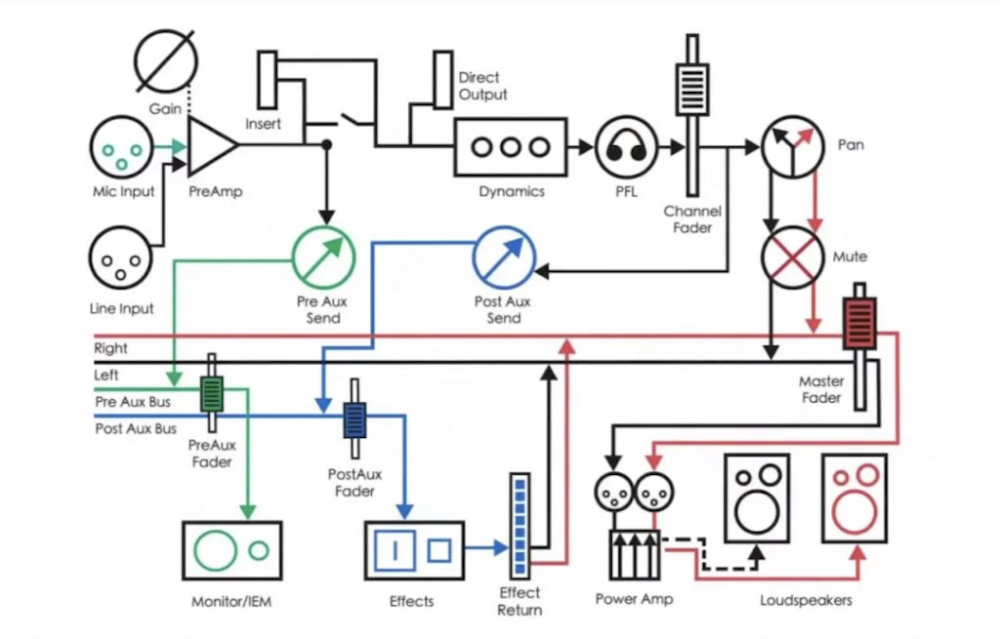

## **Production**

### Audio interface

- Bit (directly proportional to the amplitude of the sound) ~ 64 bit (1 bit = 6dB)
- Buffer size (number of samples in a second):
    - 256 in recording (less latency)
    - 1024 in reproduction, mixing, mastering (more latency)
- DSP (digital signal processing, useful to use effects in real time reducing the latency)
- Low-pass filter: exclude the high frequencies

!!! Note To avoid latency it could be useful separate instrument from audio recording in two different projects with
pre-mix

**Audio signal routing**

### Audio to digital

Mechanical energy -> electric current -> conductor -> AD <-> DA

- Sampling: regular snapshot of sound (44.100Hz).
- Quantization: binary representation of the sound.

Possible sampling frequencies:

| Audio    | Video    | Classic Music |
|----------|----------|---------------|
| 44.100Hz | 48.000Hz | 176.400Hz     |
| 88.200Hz | 96.000Hz | 192.000Hz     |

To represent faithfully in the digital context, it must be represented at the double of its frequency (Nyquist theorem).
It could be helpful also if the sound was stressed (pitch-correction).

### MIDI

MIDI (Musical Instrument digital interface) are instructions which are read from instrument:

- Midi track: Rack VST - more instrument (No fader no pan)
- Instrument track: one instrument

### Mixing

Pre-mix:

- Midi to audio

- Stereo to mono

- Correct pitch

- Timing

- Strip

- Take/comp -> voice on more tracks with different values of dynamic.

- Choir align

- Breath

- Essing

- De-esser lead -> in order to remove the undesired frequencies.

- Picks

- Marker

- Disposition 4 most important tracks -> Bass, Lead, Kick, Snare (Center).

- Side instruments -> for instruments max pan 80 (GTR EL D), effects max pan 100.

- Groups and routing

- Volume alignment -> 0dBu = 0,775 V, 0dBvu = 1,228 V = 4dBu, -14dBfs = 0dBvu (each track, important for analog plugin
  which works well at this volume).

!!! Warning N.B: each track must be under the -14dBfs.

The mixing phase could be divided into 8 steps:

1. Take Low frequencies tracks to -14dBfs (each single tracks from the gain).
2. Align all the tracks to the lowest Loudness. (AudioAnalyzer)
3. Take the main track with all the instrumental cropped on the main frequencies of the first one.

   To handle the frequencies which are on the same phase:
    - side-chain -> EQ in bass (vst3), activate side chain and in the send of the kick pass the bass in pre-fader.
    - EQ multi-width
    - ED dynamic

4. Bracketing, cut the useless frequencies with low pass and high pass filter. Low frequencies 18dB for octave, high
   frequencies 12dB for octave gaining headroom.

5. Delete Resonance between 1000Hz-3000Hz, short bell to analyze and down the frequency in that point.

6. Compression: Ratio 4:1, Release fast. Using it in order to increase the loudness lower the peak or gained headroom
   (optical compressor for vocal) (Middle-Low tracks) -> Loudness in input equal to the Loudness in output with a pick
   less tall.

7. Demasking, free some frequencies take from other instruments (EQ linear with subtraction technique):
    - clean up with low-pass and high pass filter
    - clean main frequency from other instruments.

8. Color EQ: SSL, no linear EQ. Emphasize some frequencies.

**Compressor**

A compressor handle a series of parameters:

- Threshold: value which above it the compressor starts to work.
- Ratio (rapport of compression): the quantity of sound which is attenuated in relation to the quantity of the sound
  which pass the threshold. A ratio equals to an -infinite is the behavior of a limiter
- Attack: determines the period of time between when the sound oversteps the threshold and when the sound is compressed.
  The compressor lets pass an X mms of the signal and after that it starts to work. With a faster attack also the more
  defined transition would be compressed, instead with the slowest attack the first portion of sound wasn't processed
  the other no. It intervenes in order to gain a headroom the first part of the signal.
- Release: It is expressed in mms as well and indicated the time when the signal goes below the threshold and in which
  it'll be released.
- Hold: needs to increase the compression effect between the threshold and the release.

Start from a high attack and a release low until then make the sound musically again.

**Equalizator**

The EQ serves to add or remove frequencies, exist 2 kind of EQ:

- Series: safe, doesn't modify the signal.
- Parallel: remove filter to emphasize, invert the phase to remove the frequency emphasized

- Graphic: knobs.
- Parametric: allow the control to everything, can be set to work from a specified frequency, Q (merit factor) needs to
  modify the length of the wave
- Shelf: boost or attenuate the start or the end or both of them of the signal
- Semi-parametric: as the parametric but without che control on the bells.

- color: handle also the harmonics which enrich the sound.
- linear: they weigh more on the CPU but they do not distort the sound.
- no linear eq: cutting the low frequencies could create some phase shift and obtain some not desired result (less
  exactly).

De-masking: remove some frequencies to benefit from others frequencies of others instruments.

**Filtering**

Save preset with low and high frequencies and with a positive notch.

**Phase align**

Usually in real drums or in choirs, when some part were captured from different microphones (AutoAlign).

**Signal routing**

- Filter: HI-PASS / LO-PASS, it needs to remove garbage.
- Compressor: handle the principal frequency and remove hi and low picks, it allows to gain headroom. In this way it
  removes some color from the sound which could be recreated with the EQ
- EQ: In order to reward the original sound.
- Fader: In order to amplify the signal.

N.B: two signals where one is 10dB decibel less than the other but the perceived volume is the same, when up the volume
to 0dB the sound with the lower pick wins, it gains more headroom. In this way the volume can be increase more than the
other one.

**Transient designer**

Needs to modify portions of the sounds.

**Volume meter**

Exist two unit measure to measure the volume level:

- Peak (pick volume): measure the highest pick reached by the signal (pressure in relation of the frequency)
- Rms (root main square): measure the average volume of a signal (average acoustic pressure in a period of time,
  independent of the frequency). The same RMS on two different frequency could be perceived with a different volume. It
  is strictly correlated to how the sound and the dynamics are perceived.

### Recording techniques

- Input fader never touched
- In recording max volume: -5dB / -6dB (important for the audio interface)

**Side-chain**

The kick sends the bus inside a bass where the sound will be compressed. When the compressor is set on the bpm velocity
it creates a pumping effect on the bass on the upbeat.

**Vocal pan**

To avoid issue with frequencies, higher is the pith more open is the pan.

Low frequency set close to the center, instead of the high frequency set more to the sides.

### Room acoustic

1. The ambient must be linear
2. In a home studio the room must not be empty. The obstacles break the frequencies.
3. 1m from the frontal wall (reflex of the back of the monitors, otherwise 0m), 3m from the beside wall.
4. Heal the reflection: side-reflection (isosceles triangle in order to avoid it), back-reflation (generated from the
   back of the monitor), above-reflection (inclination of 20°, 1m from the head) and corner-reflection.
